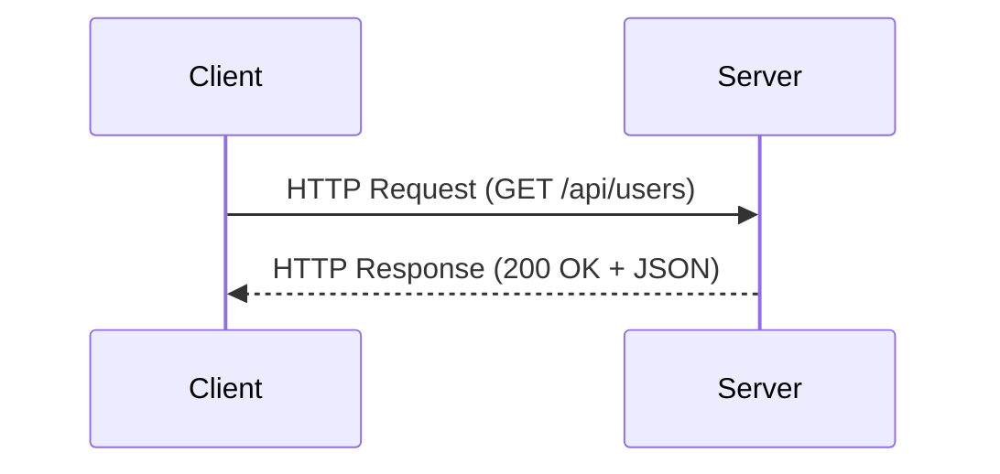

# HTTP & REST API

HTTP là giao thức nền tảng của web.
REST API là cách phổ biến để xây dựng **backend services** cho web và mobile applications.

Trang này giới thiệu:

- HTTP request / response
- HTTP methods và status codes
- nguyên tắc thiết kế REST API
- cách gọi API bằng `curl`

---

## Mục tiêu

Sau bài này bạn có thể:

- hiểu cách **HTTP hoạt động**
- sử dụng các HTTP methods phổ biến
- thiết kế **REST API endpoints**
- test API bằng **curl**

---

## Yêu cầu

Bạn cần có **terminal**.

Nếu chưa quen command line:

```text
Terminal cơ bản
```

---

## HTTP hoạt động thế nào



---

## Cấu trúc HTTP Request

Một request HTTP gồm:

```text
Method
URL
Headers
Body
```

Ví dụ:

```http
POST /api/users HTTP/1.1
Host: api.internhub.local
Content-Type: application/json
Authorization: Bearer <token>
```

Body:

```json
{
  "name": "Minh Nguyen",
  "email": "minh@internhub.local"
}
```

---

## HTTP Methods

| Method | Mục đích          | Idempotent |
| ------ | ----------------- | ---------- |
| GET    | lấy dữ liệu       | Có         |
| POST   | tạo mới           | Không      |
| PUT    | cập nhật toàn bộ  | Có         |
| PATCH  | cập nhật một phần | Có         |
| DELETE | xoá               | Có         |

---

### Ví dụ

```text
GET    /api/users
POST   /api/users
PUT    /api/users/1
PATCH  /api/users/1
DELETE /api/users/1
```

---

## HTTP Status Codes

HTTP response luôn có **status code**.

---

## 2xx – Success

| Code | Ý nghĩa    |
| ---- | ---------- |
| 200  | OK         |
| 201  | Created    |
| 204  | No Content |

---

## 3xx – Redirect

| Code | Ý nghĩa           |
| ---- | ----------------- |
| 301  | Moved Permanently |
| 304  | Not Modified      |

---

## 4xx – Client Error

| Code | Ý nghĩa      |
| ---- | ------------ |
| 400  | Bad Request  |
| 401  | Unauthorized |
| 403  | Forbidden    |
| 404  | Not Found    |

---

## 5xx – Server Error

| Code | Ý nghĩa               |
| ---- | --------------------- |
| 500  | Internal Server Error |
| 503  | Service Unavailable   |

---

## REST API Design

REST API sử dụng **resource-based URLs**.

---

## Endpoint chuẩn

```text
GET    /api/users
GET    /api/users/42
POST   /api/users
PUT    /api/users/42
DELETE /api/users/42
```

---

### Resource nested

```text
GET /api/users/42/posts
```

---

## Quy tắc thiết kế API

- dùng **danh từ số nhiều**

```text
/users
/products
/orders
```

---

- dùng **kebab-case**

```text
/order-items
```

---

- không dùng động từ trong URL

❌ Sai:

```text
/api/getUsers
/api/createUser
```

---

## Gọi API bằng curl

`curl` là công cụ CLI để gọi HTTP API.

---

## GET request

```bash
curl http://localhost:3000/api/users
```

---

## GET với header

```bash
curl -H "Authorization: Bearer <token>" \
http://localhost:3000/api/users
```

---

## POST JSON

```bash
curl -X POST http://localhost:3000/api/users \
-H "Content-Type: application/json" \
-d '{"name":"Minh Nguyen","email":"minh@internhub.local"}'
```

---

## PUT request

```bash
curl -X PUT http://localhost:3000/api/users/1 \
-H "Content-Type: application/json" \
-d '{"name":"John Updated"}'
```

---

## DELETE request

```bash
curl -X DELETE http://localhost:3000/api/users/1
```

---

## Xem headers

```bash
curl -I http://localhost:3000/api/users
```

---

## Debug request

```bash
curl -v http://localhost:3000/api/users
```

---

## JSON Request / Response

---

## Request

```json
{
  "name": "Nguyễn Văn A",
  "email": "a.nguyen@example.com",
  "role": "intern"
}
```

---

## Response

```json
{
  "id": 42,
  "name": "Nguyễn Văn A",
  "email": "a.nguyen@example.com",
  "role": "intern",
  "createdAt": "2025-01-15T10:30:00Z"
}
```

---

## Error Response

Một API tốt nên trả lỗi theo format thống nhất.

---

```json
{
  "error": {
    "code": "VALIDATION_ERROR",
    "message": "Email is required",
    "details": [
      {
        "field": "email",
        "message": "must not be empty"
      }
    ]
  }
}
```

---

## Lỗi thường gặp

| Lỗi                | Nguyên nhân             | Cách sửa        |
| ------------------ | ----------------------- | --------------- |
| connection refused | server chưa chạy        | kiểm tra port   |
| 401 Unauthorized   | thiếu token             | kiểm tra header |
| 404 Not Found      | endpoint sai            | kiểm tra URL    |
| CORS error         | server chưa enable CORS | thêm middleware |

---

## Bài tập

### Bài 1

Dùng `curl` gọi API:

```text
GET /api/users
```

---

### Bài 2

Tạo request POST:

```text
POST /api/users
```

Body:

```json
{
  "name": "Test User"
}
```

---

### Bài 3

Test các status codes:

```text
200
404
500
```

---

## Tài liệu tham khảo

```
https://developer.mozilla.org/en-US/docs/Web/HTTP/Status
```

```
https://restfulapi.net/
```
