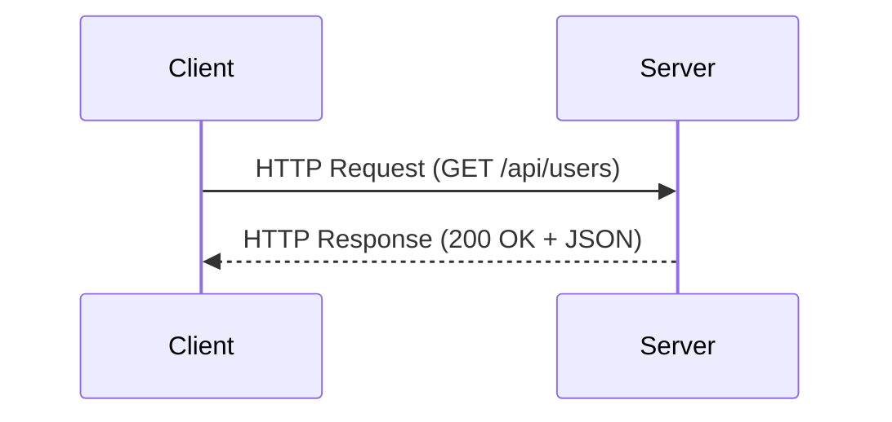

# HTTP & REST API

HTTP lĂ  giao thức nền tảng của web.
REST API lĂ  cĂ¡ch phổ biến để xĂ¢y dá»±ng **backend services** cho web vĂ  mobile applications.

Trang này giới thiệu:

- HTTP request / response
- HTTP methods vĂ  status codes
- nguyĂªn tắc thiết kế REST API
- cĂ¡ch gọi API bằng `curl`

---

## Mục tiĂªu

Sau bĂ i nĂ y bạn cĂ³ thể:

- hiểu cĂ¡ch **HTTP hoạt Ä‘á»™ng**
- sá»­ dụng cĂ¡c HTTP methods phổ biến
- thiết kế **REST API endpoints**
- test API bằng **curl**

---

## YĂªu cầu

Bạn cần cĂ³ **terminal**.

Nếu chưa quen command line:

```text
Terminal cơ bản
```

---

## HTTP hoạt Ä‘á»™ng thế nĂ o



---

## Cấu trĂºc HTTP Request

Một request HTTP gồm:

```text
Method
URL
Headers
Body
```

VĂ­ dụ:

```http
POST /api/users HTTP/1.1
Host: api.internhub.local
Content-Type: application/json
Authorization: Bearer <token>
```

Body:

```json
{
  "name": "Minh Nguyen",
  "email": "minh@internhub.local"
}
```

---

## HTTP Methods

| Method | Mục Ä‘Ă­ch          | Idempotent |
| ------ | ----------------- | ---------- |
| GET    | lấy dữ liệu       | CĂ³         |
| POST   | tạo má»›i           | KhĂ´ng      |
| PUT    | cập nhật toĂ n bá»™  | CĂ³         |
| PATCH  | cập nhật má»™t phần | CĂ³         |
| DELETE | xoĂ¡               | CĂ³         |

---

### VĂ­ dụ

```text
GET    /api/users
POST   /api/users
PUT    /api/users/1
PATCH  /api/users/1
DELETE /api/users/1
```

---

## HTTP Status Codes

HTTP response luĂ´n cĂ³ **status code**.

---

## 2xx – Success

| Code | Ý nghÄ©a    |
| ---- | ---------- |
| 200  | OK         |
| 201  | Created    |
| 204  | No Content |

---

## 3xx – Redirect

| Code | Ý nghÄ©a           |
| ---- | ----------------- |
| 301  | Moved Permanently |
| 304  | Not Modified      |

---

## 4xx – Client Error

| Code | Ý nghÄ©a      |
| ---- | ------------ |
| 400  | Bad Request  |
| 401  | Unauthorized |
| 403  | Forbidden    |
| 404  | Not Found    |

---

## 5xx – Server Error

| Code | Ý nghÄ©a               |
| ---- | --------------------- |
| 500  | Internal Server Error |
| 503  | Service Unavailable   |

---

## REST API Design

REST API sử dụng **resource-based URLs**.

---

## Endpoint chuẩn

```text
GET    /api/users
GET    /api/users/42
POST   /api/users
PUT    /api/users/42
DELETE /api/users/42
```

---

### Resource nested

```text
GET /api/users/42/posts
```

---

## Quy tắc thiết kế API

- dĂ¹ng **danh từ số nhiều**

```text
/users
/products
/orders
```

---

- dĂ¹ng **kebab-case**

```text
/order-items
```

---

- khĂ´ng dĂ¹ng Ä‘á»™ng từ trong URL

❌ Sai:

```text
/api/getUsers
/api/createUser
```

---

## Gọi API bằng curl

`curl` lĂ  cĂ´ng cụ CLI để gọi HTTP API.

---

## GET request

```bash
curl http://localhost:3000/api/users
```

---

## GET vá»›i header

```bash
curl -H "Authorization: Bearer <token>" \
http://localhost:3000/api/users
```

---

## POST JSON

```bash
curl -X POST http://localhost:3000/api/users \
-H "Content-Type: application/json" \
-d '{"name":"Minh Nguyen","email":"minh@internhub.local"}'
```

---

## PUT request

```bash
curl -X PUT http://localhost:3000/api/users/1 \
-H "Content-Type: application/json" \
-d '{"name":"John Updated"}'
```

---

## DELETE request

```bash
curl -X DELETE http://localhost:3000/api/users/1
```

---

## Xem headers

```bash
curl -I http://localhost:3000/api/users
```

---

## Debug request

```bash
curl -v http://localhost:3000/api/users
```

---

## JSON Request / Response

---

## Request

```json
{
  "name": "Nguyễn Văn A",
  "email": "a.nguyen@example.com",
  "role": "intern"
}
```

---

## Response

```json
{
  "id": 42,
  "name": "Nguyễn Văn A",
  "email": "a.nguyen@example.com",
  "role": "intern",
  "createdAt": "2025-01-15T10:30:00Z"
}
```

---

## Error Response

Má»™t API tốt nĂªn trả lá»—i theo format thống nhất.

---

```json
{
  "error": {
    "code": "VALIDATION_ERROR",
    "message": "Email is required",
    "details": [
      {
        "field": "email",
        "message": "must not be empty"
      }
    ]
  }
}
```

---

## Lỗi thường gặp

| Lá»—i                | NguyĂªn nhĂ¢n             | CĂ¡ch sá»­a        |
| ------------------ | ----------------------- | --------------- |
| connection refused | server chưa chạy        | kiểm tra port   |
| 401 Unauthorized   | thiếu token             | kiểm tra header |
| 404 Not Found      | endpoint sai            | kiểm tra URL    |
| CORS error         | server chÆ°a enable CORS | thĂªm middleware |

---

## BĂ i tập

### BĂ i 1

DĂ¹ng `curl` gọi API:

```text
GET /api/users
```

---

### BĂ i 2

Tạo request POST:

```text
POST /api/users
```

Body:

```json
{
  "name": "Test User"
}
```

---

### BĂ i 3

Test cĂ¡c status codes:

```text
200
404
500
```

---

## TĂ i liệu tham khảo

```
https://developer.mozilla.org/en-US/docs/Web/HTTP/Status
```

```
https://restfulapi.net/
```
