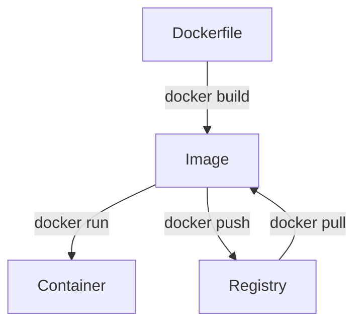

# Docker Runtime Cơ Bản

Phần này tập trung vào image, container và các thao tác chạy container.

---

## KhĂ¡i niệm cốt lõi



---

| ThĂ nh phần | Ý nghÄ©a                      |
| ---------- | ---------------------------- |
| Image      | template chỉ đọc chứa app    |
| Container  | instance đang chạy của image |
| Volume     | storage persistent           |
| Network    | mạng giữa containers         |

---

## VĂ­ dụ dá»… hiểu

| Docker    | Thực tế              |
| --------- | -------------------- |
| Image     | file cĂ i đặt Windows |
| Container | mĂ¡y Ä‘Ă£ cĂ i Windows   |
| Volume    | ổ USB                |
| Network   | LAN                  |

---

## Chạy container

VĂ­ dụ Ä‘Æ¡n giản nhất:

```bash
docker run hello-world
```

Docker sẽ:

1. pull image
2. tạo container
3. chạy container

---

## Chạy container với options

```bash
docker run -d \
--name my-nginx \
-p 8080:80 \
-v $(pwd)/html:/usr/share/nginx/html \
nginx:alpine
```

---

## Giải thĂ­ch

| Option   | Ý nghÄ©a           |
| -------- | ----------------- |
| `-d`     | chạy background   |
| `--name` | đặt tĂªn container |
| `-p`     | port mapping      |
| `-v`     | mount volume      |

---

Sau khi chạy:

```
http://localhost:8080
```

---

## Quản lĂ½ container

---

## Xem container

```bash
docker ps
```

---

Xem cả container Ä‘Ă£ stop:

```bash
docker ps -a
```

---

## Stop container

```bash
docker stop my-nginx
```

---

## Start container

```bash
docker start my-nginx
```

---

## Restart

```bash
docker restart my-nginx
```

---

## Remove container

```bash
docker rm my-nginx
```

---

Force remove:

```bash
docker rm -f my-nginx
```

---

