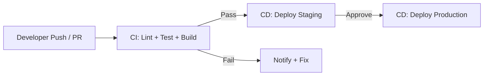

# CI/CD Fundamentals

Phần này giới thiệu CI/CD, cấu trúc workflow và quy tắc pipeline cơ bản.

---

## CI/CD là gì?



| Thuật ngữ                           | Ý nghÄ©a                                                      |
| ----------------------------------- | ------------------------------------------------------------ |
| CI (Continuous Integration)         | tá»± Ä‘á»™ng lint/test/build khi push/PR                          |
| CD (Continuous Delivery/Deployment) | tự động deploy sau khi CI pass (tuỳ mức tự động)             |
| Workflow                            | file YAML mĂ´ tả pipeline                                     |
| Job                                 | nhĂ³m step chạy trĂªn 1 runner                                 |
| Step                                | 1 hĂ nh Ä‘á»™ng trong job (checkout, setup runtime, run command) |

---

## Cấu trĂºc thÆ° mục chuẩn

```text
.github/
└── workflows/
    ├── ci.yml
    ├── docker.yml
    ├── deploy.yml
    └── docs.yml
```

---

## Quy tắc CI “chuẩn team”

- CI chạy trĂªn **Pull Request** lĂ  quan trọng nhất
- PR chỉ được merge khi **CI xanh**
- Workflow nĂªn:
  - **nhanh**
  - **deterministic** (khĂ´ng phụ thuá»™c mĂ¡y dev)
  - **cache tốt**
  - **fail sá»›m** (lint trÆ°á»›c test)

---

## Quickstart: Workflow tối thiểu

Tạo file:

```text
.github/workflows/ci.yml
```

Mẫu skeleton:

```yaml
name: CI

on:
  pull_request:
  push:
    branches: [main]

jobs:
  ci:
    runs-on: ubuntu-latest
    steps:
      - uses: actions/checkout@v4
      - name: CI placeholder
        run: echo "Hello CI"
```

---

