# Student IT Handbook

**Student IT Handbook** lĂ  tĂ i liệu thá»±c hĂ nh dĂ nh cho sinh viĂªn CĂ´ng nghệ thĂ´ng tin chuẩn bị **thá»±c tập (intern)** hoặc **bắt đầu cĂ´ng việc đầu tiĂªn trong ngĂ nh phần mềm**.

Handbook tập trung vĂ o **cĂ¡c cĂ´ng cụ vĂ  workflow thá»±c tế trong doanh nghiệp**, giĂºp sinh viĂªn chuyển từ:

```
Lập trình trong trường → Quy trình phĂ¡t triển phần mềm thá»±c tế
```

---

## Sample project xuyen suot

Toan bo handbook nay duoc xau chuoi quanh mot case study duy nhat: [InternHub API](getting-started/sample-project.md).

InternHub API la mot REST API don gian de quan ly user, bai viet noi bo, comment va tags. Khi hoc
theo handbook, ban se gap cung mot sample app o cac chuong:

- SQL va PostgreSQL
- Docker va Docker Compose
- API testing
- CI/CD
- Monitoring va deployment

Muc tieu la giup ban thay duoc mot quy trinh end-to-end thay vi nhieu vi du roi rac.

---

## Bạn sẽ học được gì

Handbook tập trung vĂ o cĂ¡c **kỹ năng kỹ thuật cÆ¡ bản mĂ  hầu hết cĂ´ng ty phần mềm yĂªu cầu**:

- Linux vĂ  Terminal cÆ¡ bản
- Git vĂ  GitHub workflow lĂ m việc nhĂ³m
- Thiết lập mĂ´i trường lập trình
- Database cơ bản (SQL / PostgreSQL)
- Docker vĂ  container hĂ³a ứng dụng
- CI/CD cơ bản
- Deployment vĂ  monitoring

Mục tiĂªu lĂ  giĂºp sinh viĂªn hiểu **quy trình phĂ¡t triển phần mềm end-to-end**.

---

## Handbook nĂ y dĂ nh cho ai

TĂ i liệu nĂ y phĂ¹ hợp vá»›i:

- Sinh viĂªn IT **năm 3–4 chuẩn bị Ä‘i thá»±c tập**
- **Fresher developer** má»›i Ä‘i lĂ m
- Người muốn học **DevOps workflow cơ bản**

YĂªu cầu kiến thức:

- Biết Ă­t nhất **má»™t ngĂ´n ngữ lập trình**
- Biết sử dụng **command line cơ bản**

---

## Lá»™ trình học tập

```mermaid
graph LR
    A[Terminal & Linux] --> B[Git & GitHub]
    B --> C[MĂ´i trường lập trình]
    C --> D[Database]
    D --> E[Docker]
    E --> F[CI/CD]
    F --> G[Deployment & Monitoring]
```



Lá»™ trình nĂ y phản Ă¡nh **quy trình phĂ¡t triển phần mềm phổ biến trong doanh nghiệp**:

```
Code → Version Control → Build → Container → CI/CD → Deploy
```

---

## Bắt đầu nhanh

Nếu bạn má»›i bắt đầu, hĂ£y học theo thứ tá»± sau:

1. Thiết lập mĂ´i trường phĂ¡t triển
2. LĂ m quen vá»›i Linux vĂ  Terminal
3. Học Git vĂ  GitHub workflow
4. Thiết lập mĂ´i trường lập trình
5. Học SQL vĂ  database cÆ¡ bản
6. Học Docker vĂ  container
7. Hiểu CI/CD pipeline

Bạn cÅ©ng cĂ³ thể **tìm nhanh ná»™i dung bằng thanh Search** hoặc mở trá»±c tiếp từng chÆ°Æ¡ng.

Neu muon di theo mot luong hoc co case study ro rang, hay mo [Sample Project: InternHub API](getting-started/sample-project.md)
ngay sau `Quickstart`.

---

## Cấu trĂºc handbook

| Phần            | Nội dung                        |
| --------------- | ------------------------------- |
| Getting Started | Thiết lập mĂ´i trường phĂ¡t triển |
| Environment     | Terminal vĂ  Linux cÆ¡ bản        |
| Version Control | Git vĂ  GitHub                   |
| Programming     | Python / Node.js environment    |
| Databases       | SQL vĂ  PostgreSQL               |
| Containers      | Docker vĂ  Docker Compose        |
| DevOps          | CI/CD, logging, security        |

---

## Vì sao handbook nĂ y được tạo ra

Nhiều sinh viĂªn biết **viết code**, nhÆ°ng gặp khĂ³ khăn khi:

- thiết lập mĂ´i trường lập trình
- lĂ m việc nhĂ³m vá»›i Git
- chạy ứng dụng bằng Docker
- hiểu pipeline CI/CD

Handbook nĂ y giĂºp **thu hẹp khoảng cĂ¡ch giữa học tập trong trường vĂ  mĂ´i trường lĂ m việc thá»±c tế**.

---

## ÄĂ³ng gĂ³p ná»™i dung

Mọi Ä‘Ă³ng gĂ³p đều được hoan nghĂªnh.

Nếu bạn muốn cải thiện handbook:

1. Fork repository
2. Tạo branch mới
3. Commit thay đổi
4. Tạo Pull Request

---

## ThĂ´ng tin phiĂªn bản

| Thuá»™c tĂ­nh | GiĂ¡ trị           |
| ---------- | ----------------- |
| PhiĂªn bản  | 1.1-draft         |
| Định dạng  | Markdown + MkDocs |
| Cập nhật   | 2026              |

---
