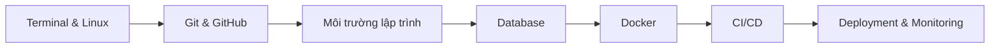

# Student IT Handbook

**Student IT Handbook** là tài liệu thực hành dành cho sinh viên Công nghệ thông tin chuẩn bị **thực tập (intern)** hoặc **bắt đầu công việc đầu tiên trong ngành phần mềm**.

Handbook tập trung vào **các công cụ và workflow thực tế trong doanh nghiệp**, giúp sinh viên chuyển từ:

```
Lập trình trong trường → Quy trình phát triển phần mềm thực tế
```

---

## Sample project xuyên suốt

Toàn bộ handbook này được xâu chuỗi quanh một case study duy nhất: [InternHub API](getting-started/sample-project.md).

InternHub API là một REST API đơn giản để quản lý user, bài viết nội bộ, comment và tags. Khi học
theo handbook, bạn sẽ gặp cùng một sample app ở các chương:

- SQL và PostgreSQL
- Docker và Docker Compose
- API testing
- CI/CD
- Monitoring và deployment

Mục tiêu là giúp bạn thấy được một quy trình end-to-end thay vì nhiều ví dụ rời rạc.

---

## Bạn sẽ học được gì

Handbook tập trung vào các **kỹ năng kỹ thuật cơ bản mà hầu hết công ty phần mềm yêu cầu**:

- Linux và Terminal cơ bản
- Git và GitHub workflow làm việc nhóm
- Thiết lập môi trường lập trình
- Database cơ bản (SQL / PostgreSQL)
- Docker và container hóa ứng dụng
- CI/CD cơ bản
- Deployment và monitoring

Mục tiêu là giúp sinh viên hiểu **quy trình phát triển phần mềm end-to-end**.

---

## Handbook này dành cho ai

Tài liệu này phù hợp với:

- Sinh viên IT **năm 3–4 chuẩn bị đi thực tập**
- **Fresher developer** mới đi làm
- Người muốn học **DevOps workflow cơ bản**

Yêu cầu kiến thức:

- Biết ít nhất **một ngôn ngữ lập trình**
- Biết sử dụng **command line cơ bản**

---

## Lộ trình học tập



Lộ trình này phản ánh **quy trình phát triển phần mềm phổ biến trong doanh nghiệp**:

```
Code → Version Control → Build → Container → CI/CD → Deploy
```

---

## Bắt đầu nhanh

Nếu bạn mới bắt đầu, hãy học theo thứ tự sau:

1. Thiết lập môi trường phát triển
2. Làm quen với Linux và Terminal
3. Học Git và GitHub workflow
4. Thiết lập môi trường lập trình
5. Học SQL và database cơ bản
6. Học Docker và container
7. Hiểu CI/CD pipeline

Bạn cũng có thể **tìm nhanh nội dung bằng thanh Search** hoặc mở trực tiếp từng chương.

Nếu muốn đi theo một luồng học có case study rõ ràng, hãy mở [Sample Project: InternHub API](getting-started/sample-project.md)
ngay sau `Quickstart`.

---

## Cấu trúc handbook

| Phần            | Nội dung                        |
| --------------- | ------------------------------- |
| Getting Started | Thiết lập môi trường phát triển |
| Environment     | Terminal và Linux cơ bản        |
| Version Control | Git và GitHub                   |
| Programming     | Python / Node.js environment    |
| Databases       | SQL và PostgreSQL               |
| Containers      | Docker và Docker Compose        |
| DevOps          | CI/CD, logging, security        |

---

## Vì sao handbook này được tạo ra

Nhiều sinh viên biết **viết code**, nhưng gặp khó khăn khi:

- thiết lập môi trường lập trình
- làm việc nhóm với Git
- chạy ứng dụng bằng Docker
- hiểu pipeline CI/CD

Handbook này giúp **thu hẹp khoảng cách giữa học tập trong trường và môi trường làm việc thực tế**.

---

## Đóng góp nội dung

Mọi đóng góp đều được hoan nghênh.

Nếu bạn muốn cải thiện handbook:

1. Fork repository
2. Tạo branch mới
3. Commit thay đổi
4. Tạo Pull Request

---

## Thông tin phiên bản

| Thuộc tính | Giá trị           |
| ---------- | ----------------- |
| Phiên bản  | 1.1-draft         |
| Định dạng  | Markdown + MkDocs |
| Cập nhật   | 2026              |

---
