# Lá»—i thường gặp & CĂ¡ch xá»­ lĂ½

## Mục tiĂªu

Trang nĂ y tổng hợp cĂ¡c lá»—i phổ biến nhất mĂ  sinh viĂªn gặp khi thá»±c tập, kèm nguyĂªn nhĂ¢n vĂ  cĂ¡ch xá»­ lĂ½ nhanh.

---

## Git

| #   | Lá»—i                                              | NguyĂªn nhĂ¢n                      | CĂ¡ch sá»­a                                                                               |
| --- | ------------------------------------------------ | -------------------------------- | -------------------------------------------------------------------------------------- |
| 1   | `fatal: not a git repository`                    | ChÆ°a `git init` hoặc sai thÆ° mục | `cd` vĂ o Ä‘Ăºng thÆ° mục chứa `.git`                                                      |
| 2   | `error: failed to push some refs`                | Remote cĂ³ commit bạn chÆ°a pull   | `git pull --rebase origin main` rồi `git push`                                         |
| 3   | `CONFLICT (content): Merge conflict in file.txt` | 2 người sá»­a cĂ¹ng vị trĂ­          | Mở file → sá»­a conflict thủ cĂ´ng → `git add` → `git commit`                             |
| 4   | `Permission denied (publickey)`                  | SSH key chưa setup               | [Tạo SSH key](https://docs.github.com/en/authentication/connecting-to-github-with-ssh) |
| 5   | `detached HEAD state`                            | `git checkout` vĂ o commit hash   | `git switch main` để quay lại branch                                                   |
| 6   | Commit nhầm file lá»›n (>100MB)                    | File vượt giá»›i hạn GitHub        | `git reset HEAD~1`, thĂªm vĂ o `.gitignore`                                              |
| 7   | Commit nhầm `.env` / secrets                     | QuĂªn `.gitignore`                | Rotate secrets, dĂ¹ng `git filter-branch` để xoĂ¡ khỏi history                           |

### Script khĂ´i phục Git

```bash
# Undo commit gần nhất (giữ code)
git reset --soft HEAD~1

# Undo tất cả thay đổi chưa commit (CẨN THẬN!)
git checkout -- .

# Xem lịch sá»­ tất cả thao tĂ¡c (kể cả Ä‘Ă£ reset)
git reflog

# Quay lại trạng thĂ¡i bất kỳ
git reset --hard HEAD@{3}
```

---

## Docker

| #   | Lá»—i                                   | NguyĂªn nhĂ¢n                      | CĂ¡ch sá»­a                                       |
| --- | ------------------------------------- | -------------------------------- | ---------------------------------------------- |
| 1   | `Cannot connect to the Docker daemon` | Docker Desktop chưa chạy         | Mở Docker Desktop                              |
| 2   | `port is already allocated`           | Port Ä‘Ă£ bị chiếm                 | `docker ps` → stop container cÅ©, hoặc đổi port |
| 3   | `no space left on device`             | Docker dĂ¹ng hết disk             | `docker system prune -a --volumes`             |
| 4   | Container exit code 137               | Out of memory (OOM killed)       | Tăng RAM cho Docker Desktop                    |
| 5   | Container exit ngay lập tức           | CMD/ENTRYPOINT lỗi               | `docker logs <name>` để xem lỗi                |
| 6   | `exec format error`                   | Image build cho sai architecture | ThĂªm `--platform linux/amd64`                  |
| 7   | Volume permission denied              | Container user khĂ¡c host user    | `chown` hoặc dĂ¹ng `user:` trong compose        |

### Script dọn dẹp Docker

```bash
# Dọn tất cả (containers dừng, images orphan, volumes khĂ´ng dĂ¹ng)
docker system prune -a --volumes

# Xem disk usage
docker system df

# Kill tất cả container đang chạy
docker stop $(docker ps -q)

# XoĂ¡ tất cả container
docker rm $(docker ps -aq)
```

---

## Python

| #   | Lá»—i                                                | NguyĂªn nhĂ¢n                     | CĂ¡ch sá»­a                                          |
| --- | -------------------------------------------------- | ------------------------------- | ------------------------------------------------- |
| 1   | `ModuleNotFoundError: No module named 'xxx'`       | Package chÆ°a cĂ i trong env Ä‘Ăºng | `which python` → kiểm tra env → `pip install xxx` |
| 2   | `command not found: python`                        | Python chÆ°a cĂ i hoặc alias sai  | DĂ¹ng `python3`, hoặc cĂ i qua pyenv/conda          |
| 3   | `pip install` bị permission denied                 | CĂ i global trĂªn Linux           | KĂ­ch hoạt venv trÆ°á»›c, hoặc dĂ¹ng `--user`          |
| 4   | `SyntaxError: invalid syntax`                      | Sai Python version (2 vs 3)     | Đảm bảo dĂ¹ng Python 3.9+                          |
| 5   | `UnicodeDecodeError`                               | File encoding khĂ´ng phải UTF-8  | `open(file, encoding='utf-8')`                    |
| 6   | `IndentationError`                                 | Trá»™n tab vĂ  space               | Cấu hình editor dĂ¹ng 4 spaces                     |
| 7   | `RecursionError: maximum recursion depth exceeded` | Đệ quy vĂ´ hạn                   | Kiểm tra base case                                |

### Debug nhanh Python

```bash
# Kiểm tra Python nĂ o Ä‘ang dĂ¹ng
which python
python --version

# Kiểm tra package Ä‘Ă£ cĂ i chÆ°a
pip list | grep flask

# Kiểm tra env Ä‘ang dĂ¹ng
echo $VIRTUAL_ENV     # venv
echo $CONDA_DEFAULT_ENV  # conda
```

---

## Database (PostgreSQL)

| #   | Lá»—i                                              | NguyĂªn nhĂ¢n                     | CĂ¡ch sá»­a                                                     |
| --- | ------------------------------------------------ | ------------------------------- | ------------------------------------------------------------ |
| 1   | `Connection refused`                             | PostgreSQL chưa chạy            | `docker start postgres-dev`                                  |
| 2   | `FATAL: password authentication failed`          | Sai password                    | Kiểm tra `POSTGRES_PASSWORD` trong docker env                |
| 3   | `relation "table" does not exist`                | Chưa tạo bảng                   | Chạy migration hoặc `CREATE TABLE`                           |
| 4   | `duplicate key value violates unique constraint` | Insert data trĂ¹ng unique column | Kiểm tra data, dĂ¹ng `ON CONFLICT`                            |
| 5   | `too many connections`                           | Connection pool cạn             | Kiểm tra code khĂ´ng close connection, tăng `max_connections` |

```bash
# Kiểm tra PostgreSQL đang chạy
docker ps | grep postgres

# Kết nối test
docker exec -it postgres-dev psql -U dev -d internhub -c "SELECT 1;"
```

---

## Network / API

| #   | Lá»—i                                   | NguyĂªn nhĂ¢n                           | CĂ¡ch sá»­a                                           |
| --- | ------------------------------------- | ------------------------------------- | -------------------------------------------------- |
| 1   | `ECONNREFUSED` / `Connection refused` | Server chưa chạy hoặc sai port        | Kiểm tra server, kiểm tra port                     |
| 2   | `CORS error` (browser)                | Server chÆ°a cho phĂ©p origin           | ThĂªm CORS middleware                               |
| 3   | `EADDRINUSE: address already in use`  | Port Ä‘Ă£ bị chiếm                      | `lsof -i :PORT` → `kill PID`, hoặc đổi port        |
| 4   | `ETIMEDOUT`                           | Server quĂ¡ chậm hoặc khĂ´ng reach được | Kiểm tra network, firewall, DNS                    |
| 5   | `SSL certificate problem`             | Self-signed cert hoặc cert expired    | Update cert, hoặc tạm tắt SSL verify (chỉ khi dev) |

```bash
# Kiểm tra port đang mở
lsof -i :3000          # macOS/Linux
netstat -ano | findstr :3000  # Windows

# Test connectivity
curl -v http://localhost:3000/api/health

# DNS check
nslookup api.example.com
```

---

## WSL / Windows

| #   | Lá»—i                                    | NguyĂªn nhĂ¢n                      | CĂ¡ch sá»­a                                    |
| --- | -------------------------------------- | -------------------------------- | ------------------------------------------- |
| 1   | WSL rất chậm                           | Project nằm ở `/mnt/c/`          | Chuyển project sang `/home/user/` trong WSL |
| 2   | Line ending warning Git                | CRLF vs LF                       | `git config --global core.autocrlf input`   |
| 3   | Docker khĂ´ng chạy trong WSL            | ChÆ°a bật WSL integration         | Docker Desktop → Settings → WSL Integration |
| 4   | `chmod` khĂ´ng hoạt Ä‘á»™ng trĂªn `/mnt/c/` | Windows filesystem khĂ´ng support | LĂ m việc trong WSL filesystem (`/home/`)    |

---

## Quy trình debug chung

```mermaid
graph TB
    A[Gặp lỗi] --> B{Đọc error message}
    B --> C[Google / Stack Overflow]
    B --> D[Kiểm tra logs]
    D --> E{Tìm được nguyĂªn nhĂ¢n?}
    C --> E
    E -->|CĂ³| F[Fix & Test]
    E -->|KhĂ´ng| G[Hỏi đồng nghiệp / mentor]
    F --> H{Fix thĂ nh cĂ´ng?}
    H -->|CĂ³| I[Ghi chĂº lại để lần sau]
    H -->|KhĂ´ng| G
```



**Tips debug:**

1. **Đọc kỹ error message** – 80% thĂ´ng tin ở dĂ²ng cuối cĂ¹ng.
2. **Copy error message** → tìm Google/Stack Overflow.
3. **Kiểm tra logs** – `docker logs`, server log, browser console.
4. **Reproduce** – viết lại bÆ°á»›c gĂ¢y lá»—i.
5. **Isolate** – comment bá»›t code để tìm dĂ²ng gĂ¢y lá»—i.
6. **Ghi chĂº** – viết lại cĂ¡ch fix để lần sau khĂ´ng mất thời gian.

---

## TĂ i liệu tham khảo

- [Stack Overflow](https://stackoverflow.com/)
- [DevDocs](https://devdocs.io/) – Documentation cho mọi ngĂ´n ngữ
