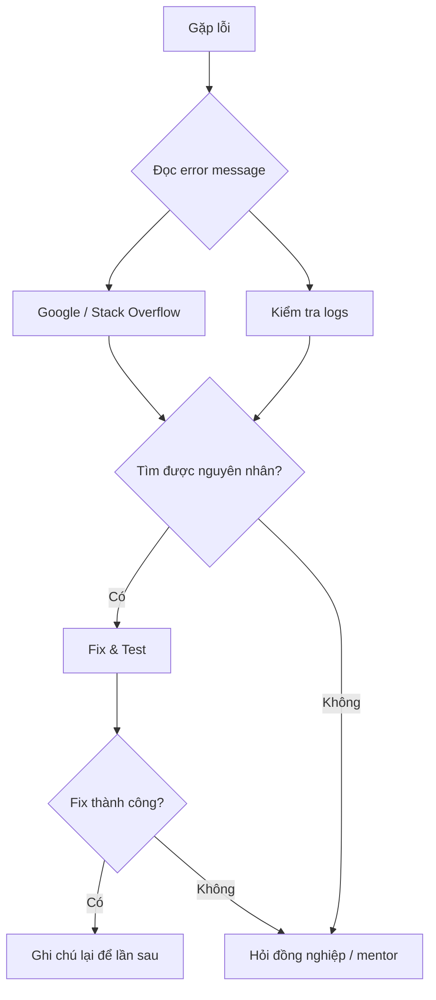

# Lỗi thường gặp & Cách xử lý

## Mục tiêu

Trang này tổng hợp các lỗi phổ biến nhất mà sinh viên gặp khi thực tập, kèm nguyên nhân và cách xử lý nhanh.

---

## Git

| #   | Lỗi                                              | Nguyên nhân                      | Cách sửa                                                                               |
| --- | ------------------------------------------------ | -------------------------------- | -------------------------------------------------------------------------------------- |
| 1   | `fatal: not a git repository`                    | Chưa `git init` hoặc sai thư mục | `cd` vào đúng thư mục chứa `.git`                                                      |
| 2   | `error: failed to push some refs`                | Remote có commit bạn chưa pull   | `git pull --rebase origin main` rồi `git push`                                         |
| 3   | `CONFLICT (content): Merge conflict in file.txt` | 2 người sửa cùng vị trí          | Mở file → sửa conflict thủ công → `git add` → `git commit`                             |
| 4   | `Permission denied (publickey)`                  | SSH key chưa setup               | [Tạo SSH key](https://docs.github.com/en/authentication/connecting-to-github-with-ssh) |
| 5   | `detached HEAD state`                            | `git checkout` vào commit hash   | `git switch main` để quay lại branch                                                   |
| 6   | Commit nhầm file lớn (>100MB)                    | File vượt giới hạn GitHub        | `git reset HEAD~1`, thêm vào `.gitignore`                                              |
| 7   | Commit nhầm `.env` / secrets                     | Quên `.gitignore`                | Rotate secrets, dùng `git filter-branch` để xoá khỏi history                           |

### Script khôi phục Git

```bash
# Undo commit gần nhất (giữ code)
git reset --soft HEAD~1

# Undo tất cả thay đổi chưa commit (CẨN THẬN!)
git checkout -- .

# Xem lịch sử tất cả thao tác (kể cả đã reset)
git reflog

# Quay lại trạng thái bất kỳ
git reset --hard HEAD@{3}
```

---

## Docker

| #   | Lỗi                                   | Nguyên nhân                      | Cách sửa                                       |
| --- | ------------------------------------- | -------------------------------- | ---------------------------------------------- |
| 1   | `Cannot connect to the Docker daemon` | Docker Desktop chưa chạy         | Mở Docker Desktop                              |
| 2   | `port is already allocated`           | Port đã bị chiếm                 | `docker ps` → stop container cũ, hoặc đổi port |
| 3   | `no space left on device`             | Docker dùng hết disk             | `docker system prune -a --volumes`             |
| 4   | Container exit code 137               | Out of memory (OOM killed)       | Tăng RAM cho Docker Desktop                    |
| 5   | Container exit ngay lập tức           | CMD/ENTRYPOINT lỗi               | `docker logs <name>` để xem lỗi                |
| 6   | `exec format error`                   | Image build cho sai architecture | Thêm `--platform linux/amd64`                  |
| 7   | Volume permission denied              | Container user khác host user    | `chown` hoặc dùng `user:` trong compose        |

### Script dọn dẹp Docker

```bash
# Dọn tất cả (containers dừng, images orphan, volumes không dùng)
docker system prune -a --volumes

# Xem disk usage
docker system df

# Kill tất cả container đang chạy
docker stop $(docker ps -q)

# Xoá tất cả container
docker rm $(docker ps -aq)
```

---

## Python

| #   | Lỗi                                                | Nguyên nhân                     | Cách sửa                                          |
| --- | -------------------------------------------------- | ------------------------------- | ------------------------------------------------- |
| 1   | `ModuleNotFoundError: No module named 'xxx'`       | Package chưa cài trong env đúng | `which python` → kiểm tra env → `pip install xxx` |
| 2   | `command not found: python`                        | Python chưa cài hoặc alias sai  | Dùng `python3`, hoặc cài qua pyenv/conda          |
| 3   | `pip install` bị permission denied                 | Cài global trên Linux           | Kích hoạt venv trước, hoặc dùng `--user`          |
| 4   | `SyntaxError: invalid syntax`                      | Sai Python version (2 vs 3)     | Đảm bảo dùng Python 3.9+                          |
| 5   | `UnicodeDecodeError`                               | File encoding không phải UTF-8  | `open(file, encoding='utf-8')`                    |
| 6   | `IndentationError`                                 | Trộn tab và space               | Cấu hình editor dùng 4 spaces                     |
| 7   | `RecursionError: maximum recursion depth exceeded` | Đệ quy vô hạn                   | Kiểm tra base case                                |

### Debug nhanh Python

```bash
# Kiểm tra Python nào đang dùng
which python
python --version

# Kiểm tra package đã cài chưa
pip list | grep flask

# Kiểm tra env đang dùng
echo $VIRTUAL_ENV     # venv
echo $CONDA_DEFAULT_ENV  # conda
```

---

## Database (PostgreSQL)

| #   | Lỗi                                              | Nguyên nhân                     | Cách sửa                                                     |
| --- | ------------------------------------------------ | ------------------------------- | ------------------------------------------------------------ |
| 1   | `Connection refused`                             | PostgreSQL chưa chạy            | `docker start postgres-dev`                                  |
| 2   | `FATAL: password authentication failed`          | Sai password                    | Kiểm tra `POSTGRES_PASSWORD` trong docker env                |
| 3   | `relation "table" does not exist`                | Chưa tạo bảng                   | Chạy migration hoặc `CREATE TABLE`                           |
| 4   | `duplicate key value violates unique constraint` | Insert data trùng unique column | Kiểm tra data, dùng `ON CONFLICT`                            |
| 5   | `too many connections`                           | Connection pool cạn             | Kiểm tra code không close connection, tăng `max_connections` |

```bash
# Kiểm tra PostgreSQL đang chạy
docker ps | grep postgres

# Kết nối test
docker exec -it postgres-dev psql -U dev -d internhub -c "SELECT 1;"
```

---

## Network / API

| #   | Lỗi                                   | Nguyên nhân                           | Cách sửa                                           |
| --- | ------------------------------------- | ------------------------------------- | -------------------------------------------------- |
| 1   | `ECONNREFUSED` / `Connection refused` | Server chưa chạy hoặc sai port        | Kiểm tra server, kiểm tra port                     |
| 2   | `CORS error` (browser)                | Server chưa cho phép origin           | Thêm CORS middleware                               |
| 3   | `EADDRINUSE: address already in use`  | Port đã bị chiếm                      | `lsof -i :PORT` → `kill PID`, hoặc đổi port        |
| 4   | `ETIMEDOUT`                           | Server quá chậm hoặc không reach được | Kiểm tra network, firewall, DNS                    |
| 5   | `SSL certificate problem`             | Self-signed cert hoặc cert expired    | Update cert, hoặc tạm tắt SSL verify (chỉ khi dev) |

```bash
# Kiểm tra port đang mở
lsof -i :3000          # macOS/Linux
netstat -ano | findstr :3000  # Windows

# Test connectivity
curl -v http://localhost:3000/api/health

# DNS check
nslookup api.example.com
```

---

## WSL / Windows

| #   | Lỗi                                    | Nguyên nhân                      | Cách sửa                                    |
| --- | -------------------------------------- | -------------------------------- | ------------------------------------------- |
| 1   | WSL rất chậm                           | Project nằm ở `/mnt/c/`          | Chuyển project sang `/home/user/` trong WSL |
| 2   | Line ending warning Git                | CRLF vs LF                       | `git config --global core.autocrlf input`   |
| 3   | Docker không chạy trong WSL            | Chưa bật WSL integration         | Docker Desktop → Settings → WSL Integration |
| 4   | `chmod` không hoạt động trên `/mnt/c/` | Windows filesystem không support | Làm việc trong WSL filesystem (`/home/`)    |

---

## Quy trình debug chung



**Tips debug:**

1. **Đọc kỹ error message** – 80% thông tin ở dòng cuối cùng.
2. **Copy error message** → tìm Google/Stack Overflow.
3. **Kiểm tra logs** – `docker logs`, server log, browser console.
4. **Reproduce** – viết lại bước gây lỗi.
5. **Isolate** – comment bớt code để tìm dòng gây lỗi.
6. **Ghi chú** – viết lại cách fix để lần sau không mất thời gian.

---

## Tài liệu tham khảo

- [Stack Overflow](https://stackoverflow.com/)
- [DevDocs](https://devdocs.io/) – Documentation cho mọi ngôn ngữ
