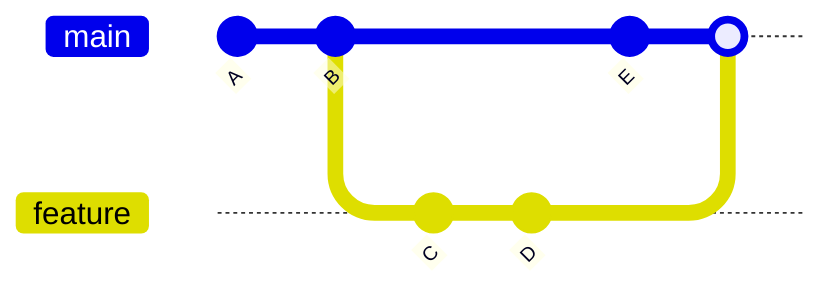

# Branching, Merge Và Rebase

Phần này tập trung vào branch workflow, merge, rebase và xử lý conflict.

---

## Branch

Branch giĂºp phĂ¡t triển **nhiều tĂ­nh năng song song**.

---

### Xem branch

```bash
git branch
```

---

### Tạo branch

```bash
git branch feature/login
```

---

### Chuyển branch

```bash
git checkout feature/login
```

hoặc:

```bash
git switch feature/login
```

---

### Tạo + chuyển branch

```bash
git checkout -b feature/login
```

hoặc:

```bash
git switch -c feature/login
```

---

### XoĂ¡ branch

```bash
git branch -d feature/login
```

Force delete:

```bash
git branch -D feature/login
```

---

## Quy tắc đặt tĂªn branch

| Prefix    | Mục Ä‘Ă­ch           |
| --------- | ------------------ |
| feature/  | tĂ­nh năng má»›i      |
| bugfix/   | sá»­a bug            |
| hotfix/   | sá»­a lá»—i production |
| docs/     | thay đổi docs      |
| refactor/ | tĂ¡i cấu trĂºc code  |

---

### VĂ­ dụ

```
feature/user-auth
bugfix/login-crash
docs/update-readme
refactor/cleanup-utils
```

---

## Merge vs Rebase

---

## Merge

```bash
git checkout main
git merge feature/login
```



Merge tạo **merge commit**.

---

## Rebase

```bash
git checkout feature/login
git rebase main
```

Sau Ä‘Ă³:

```bash
git checkout main
git merge feature/login
```

---

!!! warning "LÆ°u Ă½"
KhĂ´ng nĂªn **rebase branch Ä‘Ă£ push vĂ  Ä‘ang được nhiều người sá»­ dụng**.

---

## Giải quyết conflict

Git sẽ Ä‘Ă¡nh dấu:

```
<<<<<<< HEAD
Code branch hiện tại
=======
Code branch khĂ¡c
>>>>>>> feature/login
```

---

### CĂ¡ch xá»­ lĂ½

1. Mở file bị conflict
2. Chọn code Ä‘Ăºng
3. XoĂ¡ marker conflict
4. Stage file

```bash
git add file.txt
```

5. Tiếp tục

```bash
git merge --continue
```

hoặc

```bash
git rebase --continue
```

---

## Commit message chuẩn

NĂªn dĂ¹ng **Conventional Commits**.

---

### Format

```
type(scope): description
```

---

### CĂ¡c type phổ biến

| Type     | Ý nghÄ©a        |
| -------- | -------------- |
| feat     | thĂªm feature   |
| fix      | sá»­a bug        |
| docs     | thay đổi docs  |
| style    | format code    |
| refactor | refactor code  |
| test     | test           |
| chore    | config / build |

---

### VĂ­ dụ

```
feat(auth): add JWT refresh token endpoint
```

---

