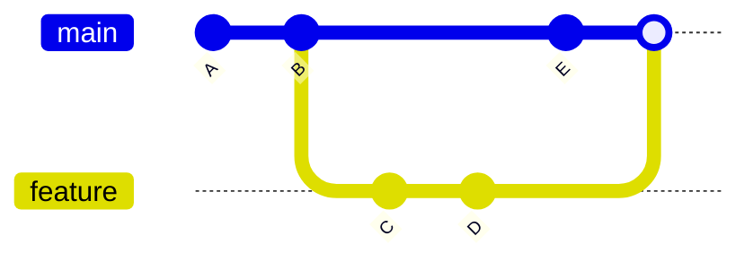

# Branching, Merge Và Rebase

Phần này tập trung vào branch workflow, merge, rebase và xử lý conflict.

---

## Branch

Branch giúp phát triển **nhiều tính năng song song**.

---

### Xem branch

```bash
git branch
```

---

### Tạo branch

```bash
git branch feature/login
```

---

### Chuyển branch

```bash
git checkout feature/login
```

hoặc:

```bash
git switch feature/login
```

---

### Tạo + chuyển branch

```bash
git checkout -b feature/login
```

hoặc:

```bash
git switch -c feature/login
```

---

### Xoá branch

```bash
git branch -d feature/login
```

Force delete:

```bash
git branch -D feature/login
```

---

## Quy tắc đặt tên branch

| Prefix    | Mục đích           |
| --------- | ------------------ |
| feature/  | tính năng mới      |
| bugfix/   | sửa bug            |
| hotfix/   | sửa lỗi production |
| docs/     | thay đổi docs      |
| refactor/ | tái cấu trúc code  |

---

### Ví dụ

```
feature/user-auth
bugfix/login-crash
docs/update-readme
refactor/cleanup-utils
```

---

## Merge vs Rebase

---

## Merge

```bash
git checkout main
git merge feature/login
```



Merge tạo **merge commit**.

---

## Rebase

```bash
git checkout feature/login
git rebase main
```

Sau đó:

```bash
git checkout main
git merge feature/login
```

---

!!! warning "Lưu ý"
Không nên **rebase branch đã push và đang được nhiều người sử dụng**.

---

## Giải quyết conflict

Git sẽ đánh dấu:

```
<<<<<<< HEAD
Code branch hiện tại
=======
Code branch khác
>>>>>>> feature/login
```

---

### Cách xử lý

1. Mở file bị conflict
2. Chọn code đúng
3. Xoá marker conflict
4. Stage file

```bash
git add file.txt
```

5. Tiếp tục

```bash
git merge --continue
```

hoặc

```bash
git rebase --continue
```

---

## Commit message chuẩn

Nên dùng **Conventional Commits**.

---

### Format

```
type(scope): description
```

---

### Các type phổ biến

| Type     | Ý nghĩa        |
| -------- | -------------- |
| feat     | thêm feature   |
| fix      | sửa bug        |
| docs     | thay đổi docs  |
| style    | format code    |
| refactor | refactor code  |
| test     | test           |
| chore    | config / build |

---

### Ví dụ

```
feat(auth): add JWT refresh token endpoint
```

---

