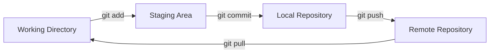

# Git Fundamentals

Phần này đi qua mô hình hoạt động của Git, khởi tạo repo, commit và đồng bộ remote.

---

## Git hoạt động thế nào



---

## Các vùng trong Git

| Vùng              | Ý nghĩa              |
| ----------------- | -------------------- |
| Working Directory | code trên máy        |
| Staging Area      | file chuẩn bị commit |
| Local Repository  | lịch sử commit local |
| Remote Repository | repo trên GitHub     |

---

## Khởi tạo repository

---

## Clone repo

```bash
git clone https://github.com/user/repo.git
cd repo
```

---

## Tạo repo mới

```bash
mkdir myproject
cd myproject
git init
```

---

## Kiểm tra trạng thái

---

### Trạng thái file

```bash
git status
```

---

### Xem lịch sử commit

```bash
git log --oneline --graph --all
```

---

### Xem thay đổi

```bash
git diff
```

---

### Xem thay đổi đã staged

```bash
git diff --staged
```

---

## Add & Commit

---

### Thêm file vào staging

```bash
git add file.txt
```

---

### Thêm toàn bộ file

```bash
git add .
```

---

### Commit

```bash
git commit -m "feat: add login API"
```

---

### Sửa commit gần nhất

```bash
git commit --amend -m "feat: add login API endpoint"
```

---

## Push & Pull

---

### Push code

```bash
git push origin main
```

---

### Pull code

```bash
git pull origin main
```

Pull thực chất là:

```
fetch + merge
```

---

### Chỉ fetch

```bash
git fetch origin
```

---

